# Questline

**A terminal RPG where defeating the Notification Swarm, surviving the Great Backlog, and leveling up your hero somehow results in getting things done.**

[](https://github.com/gibranlp/Questline-cli/releases)
[](LICENSE)
[](https://questlinecli.com)

[Download](https://questlinecli.com) &nbsp;|&nbsp; [Website](https://questlinecli.com) &nbsp;|&nbsp; [Releases](https://github.com/gibranlp/Questline-cli/releases)

---

Questline is a terminal productivity app disguised as an RPG. Complete real tasks. Level up a real character. Explore a world that grows with your output.

It runs entirely in your terminal, works offline by default, and never gets in your way.

Complete quests. Earn XP. Unlock relics and lore. Tend your Zen Tree. Join Living Chapters — cooperative world events driven by the collective progress of every player in the realm.

Questline does not ask you to become productive. It makes productivity the natural side effect of playing.

---

## Download Questline

**[questlinecli.com](https://questlinecli.com)**

Available for Windows, Linux, and macOS.
All platforms are supported through native installers, AppImage, and Cargo.

---

## Screenshots

**Intro**
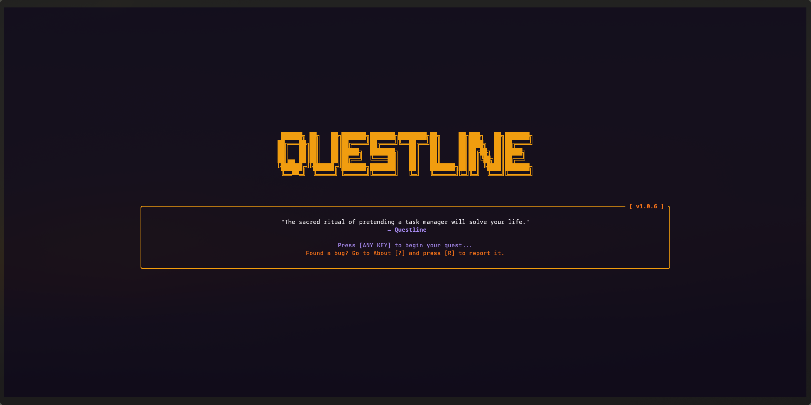
*The realm opens. A pixel art title and a quote to set the tone before anything begins.*

**The Story So Far**
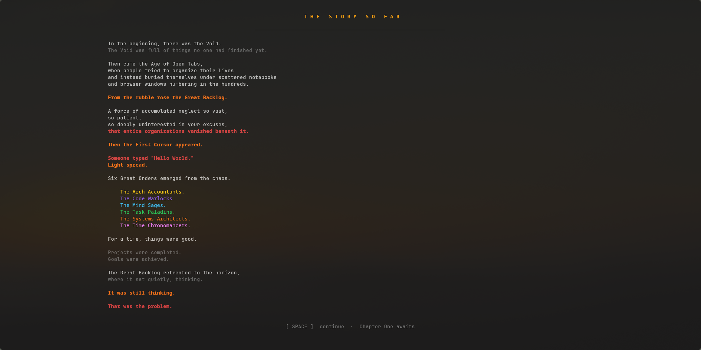
*The prologue — world lore and the state of the realm before your hero enters it.*

**Chapter One: The Notification Swarm**
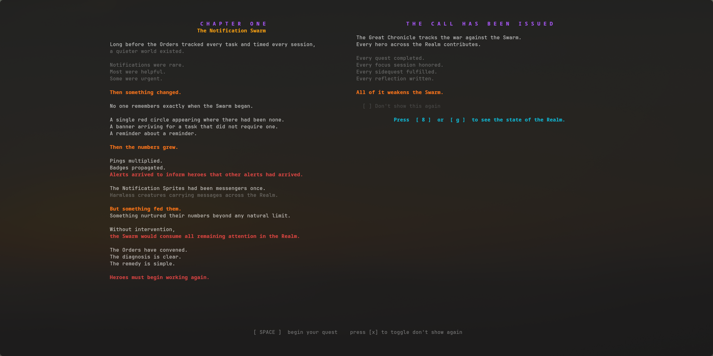
*The active Living Chapter. A cooperative call to arms with objectives the entire realm must meet.*

**Dashboard**
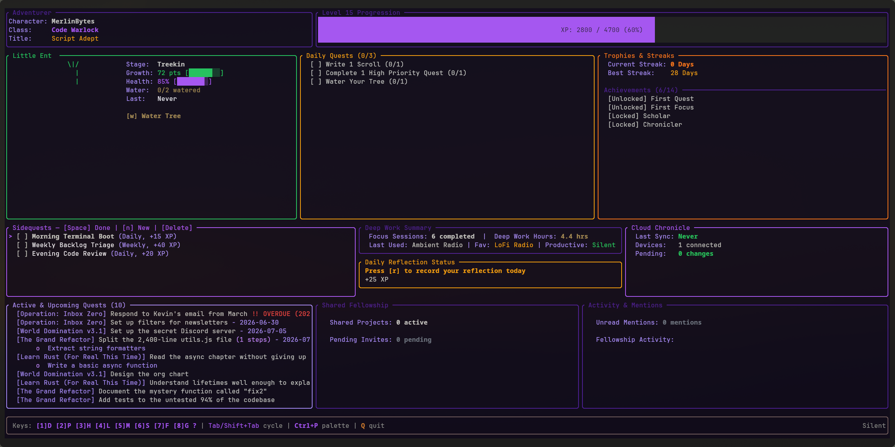
*Your hero at a glance — active quests, Zen Tree stage, focus sessions, and today's chronicle.*

**Projects**
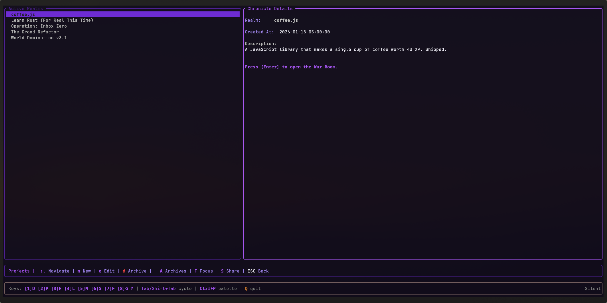
*All your active campaigns. Select one to see its chronicle history and milestones at a glance.*

**Tasks**
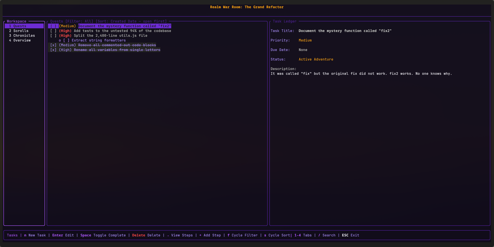
*The quest board for a project — tasks, steps, priorities, and a detail panel for each entry.*

**Scrolls**
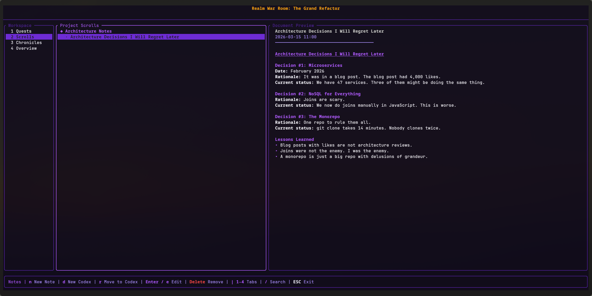
*Notes rendered as scrolls. Write in Markdown, read as lore. Every word is part of the record.*

**Project Overview**
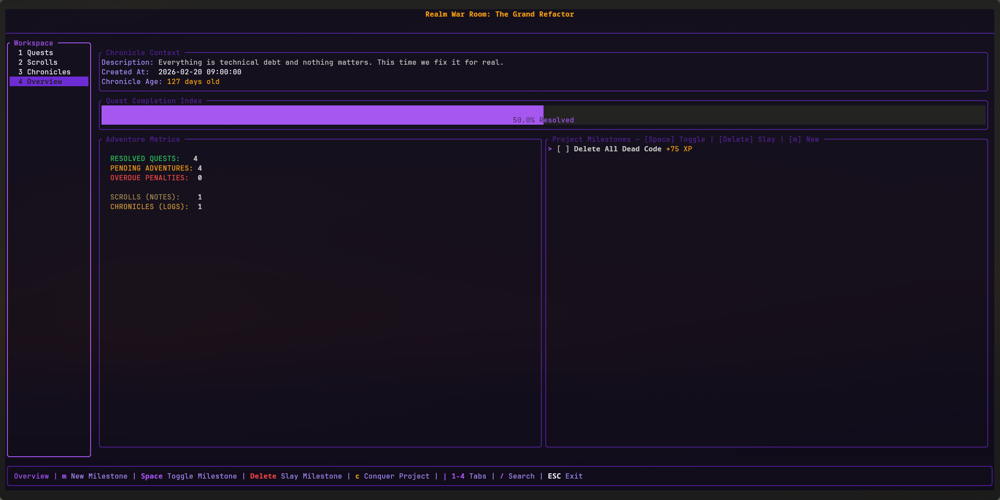
*Milestones, adventure log, and the full chronicle history of a project's arc.*

**Character**
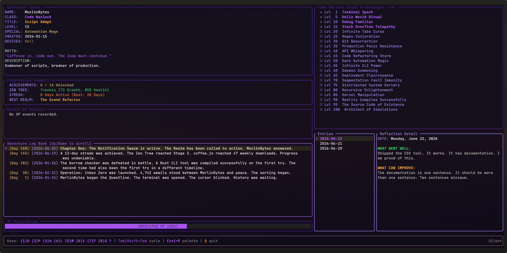
*Your hero sheet — class, level, title, achievements, skill tree, and the adventure log.*

**Lore Library**
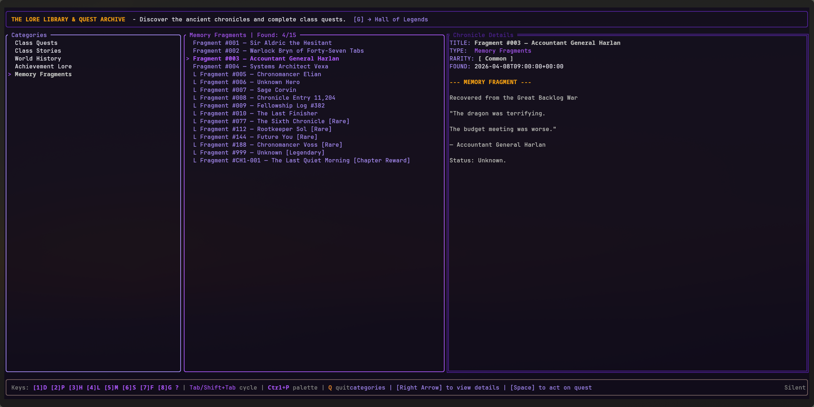
*Memory fragments, class lore, and quest archives. Most entries start locked. Earn them.*

**Soundscapes**
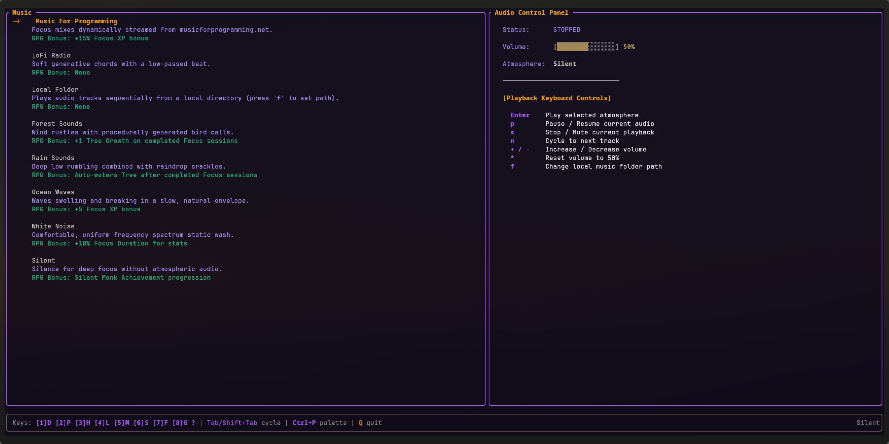
*Ambient audio for focus — Lo-Fi, rain, forest, ocean, white noise, or your own local folder.*

**Sync**
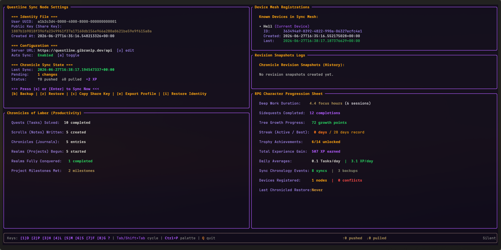
*Identity, server connection, device mesh, and your full productivity progression at a glance.*

**The Great Chronicle**
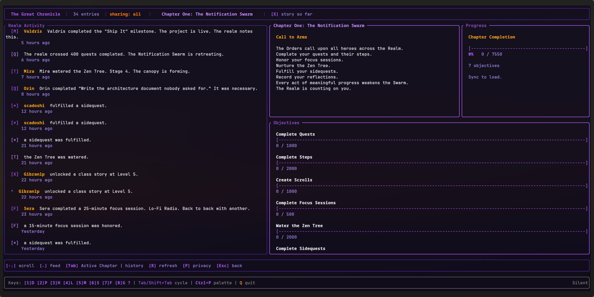
*Realm-wide activity feed, chapter objectives, and the collective progress of every hero in the realm.*

---

## Features

### Quest System
Tasks in Questline are quests. They carry priority, due dates, subtasks, and steps. Completing a quest earns XP, waters your Zen Tree, and pushes chapter objectives forward. Fail to complete daily quests and the realm takes notice.

### The Main Quest

Every time the Dashboard opens, Questline convenes an emergency session of the Planning Council — a deterministic scoring engine that reviews every incomplete task in your backlog and selects the single most important thing to do right now.

The Council is not wise. It does not know you. It does not care that the overdue task from three weeks ago is actually fine and you have been meaning to close it. It simply assigns points.

| Condition | Points |
|---|---|
| Overdue | +100 |
| Due today | +60 |
| Due tomorrow | +40 |
| Due within three days | +25 |
| Due within seven days | +10 |
| High priority | +30 |
| Medium priority | +10 |
| Low priority | +0 |

The scores stack. A High priority task due today scores 90. An overdue task of any priority scores at least 100 and will continue appearing as the Main Quest until you resolve it, archive it, or make peace with its existence.

The Council does not consider how long the task will take, how much you dread it, how many times you have quietly moved it to tomorrow, or whether finishing it would actually matter. Those are judgment calls. The Council only counts points.

The second-highest scoring task is displayed as the Recommended Next Quest — a polite suggestion from an entity that has never experienced a Tuesday afternoon.

Press `o` from the Dashboard to open the current Main Quest directly in its workspace.

### Scrolls and Codices
Notes are scrolls organized into codices — thematic collections tied to your projects. Write in Markdown, search across your full knowledge base, and share scrolls with your fellowship.

### Zen Tree
Every completed task waters a Zen Tree that lives in your dashboard. It grows through stages across hundreds of levels. It is the most honest measure of your consistency.

### Hall of Legends
Rare relics drop during long focus sessions. Legendary titles unlock through extraordinary milestones. The Hall of Legends displays everything you have earned — and what is still out of reach.

### Focus Sessions
Full-featured focus timer with selectable durations, ambient soundscapes (Rain, Pines, Ocean, Lo-Fi, and more), and automatic XP rewards for completed sessions. Your music stays with you across sessions.

### Great Chronicle
A unified activity log showing your achievements, task completions, fellowship messages, and realm-wide events in a single scrollable feed. History is written by those who show up.

### Hero Classes
Choose your calling at character creation. Six distinct classes — Task Paladin, Code Warlock, Mind Sage, Systems Architect, Time Chronomancer, Arch Accountant — each with unique passive bonuses, power trees, and specialization paths that reward playing to your strengths.

### Living Chapters
Cooperative world events that unfold in real time across all players. The realm's story advances only when its heroes contribute. Each chapter unlocks lore, memory fragments, and chronicle entries that become part of the permanent record.

### Relics
Collectible items discovered through focus sessions and long-form work. Each relic carries a unique description and rarity tier. Some are common. Some have never been found.

### Progression
Every action earns XP. XP drives levels. Levels unlock class powers, new titles, and deeper lore. Specializations let you redirect your growth. Achievements mark the moments worth remembering.

---

## Living Chapters — The Realm Moves When You Do

Questline is not a solo game.

Every player who runs Questline is part of the same realm. And that realm has a story that only moves when its heroes work.

**Chapter One: The Notification Swarm** is live.

The realm is under siege by an endless flood of interruptions — alerts, pings, distractions without end. The only answer is focus. Every task completed, every focus session run, every ritual honored, every reflection written, every Zen Tree watering — all of it counts toward the chapter's collective objectives.

When the chapter closes:

- Every contributing hero receives 5,000 XP.
- New lore entries unlock across the Library.
- Memory fragments surface for those who earned them.
- A permanent chronicle entry is written into the realm's history.
- The next chapter begins.

The Great Chronicle screen shows exactly where the realm stands. You can see other heroes' contributions, watch objectives tick forward in real time, and know that your work — however small — is part of something larger.

This is not a leaderboard. There are no winners. The realm succeeds or it does not, and that depends entirely on whether its people show up.

---

## Why Questline Exists

I was tired of productivity apps that felt like spreadsheets with notifications.

Every tool I tried was well-designed, well-intentioned, and somehow managed to make the act of organizing my work feel worse than just doing the work. The lists grew. The backlogs multiplied. The dashboards became things I avoided opening.

I started building Questline as a personal experiment. What if tasks had weight? What if finishing something felt like actually finishing something — not just moving a card from one column to another?

Tasks became quests. Notes became scrolls. Projects became campaigns with milestones and boss encounters. A small tree appeared on the dashboard and started growing every time I completed something. I found myself completing tasks just to see it grow.

What I did not expect was the world.

The lore started as flavor text. The chronicle started as a debug log. The Living Chapters started as a thought experiment about whether a productivity app could have a narrative. Somewhere along the way, Questline stopped being a productivity tool and became a world.

It is still a productivity tool. It tracks your tasks, manages your notes, runs your timers, and keeps everything in a local SQLite database that belongs entirely to you. But it is also something else — a place you return to, a character you build, a story you are part of whether you know it or not.

Build something. The realm is watching.

---

## Installation

### Linux and macOS

```bash
curl -fsSL https://raw.githubusercontent.com/gibranlp/Questline-cli/main/server/install.sh | bash
```

### Windows (PowerShell)

```powershell
irm https://raw.githubusercontent.com/gibranlp/Questline-cli/main/server/install.ps1 | iex
```

### Cargo

```bash
cargo install questline
```

---

## Community

Questline is actively developed and shaped by the people who use it.

If you run into a bug, have an idea, or just want to tell someone that a bonsai tree on a terminal made you more productive — you are in the right place.

- **Bug Reports**: Open an issue on [GitHub](https://github.com/gibranlp/Questline-cli/issues)
- **Feature Requests**: Start a discussion or open an issue with the feature label
- **General Feedback**: Use the in-app report tool (`R` on the About screen) to send feedback directly

Every report is read. Every suggestion is considered. The direction of Questline — including its future chapters — is shaped by the people who live in it.

If you find it useful, a star on the repository goes a long way toward helping other heroes find it.

---

## License

Questline is released under the MIT License.

You are free to use, modify, distribute, and build upon the project in accordance with the terms of the license.

If Questline helps you on your adventures, consider starring the repository and sharing it with fellow heroes.

---

## Changelog

### v1.1.0 — The Nodes Remember
*Released 2026-07-14*

- **Multi-device sync deduplication:** A new `processed_remote_events` table tracks every applied sync event. Already-processed events are skipped on subsequent syncs, ending the conflict accumulation that previously inflated counts into the tens of thousands.
- **Device heartbeat:** Each device now broadcasts its identity during every sync. All your nodes appear in the Sync screen with last-seen timestamps and online status.
- **Fellowship presence:** Companions in shared projects show as online or offline in the project companion list, chat title, and Companions tab. Presence decays after 10 minutes of inactivity.
- **Real-time companion sync:** Shared project workspaces sync every 8 seconds and trigger an immediate sync on open. Chat polling also runs in the background while working inside a shared project.
- **Companion task ownership badges:** Tasks created by companions in shared projects display their owner's username next to the task title.
- **Dashboard progression tree:** The Adventurer panel now shows your current unlocked class power and the next milestone to reach, styled in your class color.
- **New Evergrowth rendering and dashboard layout:** Updated visual presentation for the Evergrowth panel and overall dashboard structure.
- **Navigation reorder:** Sections renumbered — `6` = Fellowship, `7` = Great Chronicle, `8` = Sync Settings.
- **Sync-sealed exit:** Ctrl+C no longer quits. Pressing `q` opens the quit confirm; confirming triggers a final sync before the application closes.

---

### v1.0.9 — The Scrollkeeper Awakens
*Released 2026-07-11*

- **Vim-like note editor:** Notes now open in a full modal editor with Normal, Insert, and Visual modes. Navigate with hjkl, yank lines, delete words, undo and redo up to 100 steps. Press `?` inside any note for the full keybind reference.
- **Nested codex tree view:** Codices that contain other codices now display as an always-expanded tree. The full hierarchy is visible at a glance — no more drilling in and pressing Back to see what is inside.
- **Move codices:** A codex and everything inside it can now be relocated to any other parent codex, or moved back to the root, using the same refile flow as notes.
- **Notification wrapping:** Long notification messages now wrap cleanly inside the popup instead of being cut off.
- **Home / End in descriptions:** The Home and End keys now work in the task and step description field, jumping to the start or end of the current line.
- **Focus session attribution:** Each focus session is now stamped with the hero who completed it. The Chapter One contribution counter no longer double-counts sessions that sync across multiple devices.

---

### v1.0.8 — The Focus Session Listens Now
*Released 2026-07-06*

- **Real music visualizer:** The spectrum bars in the Focus tab now show the actual sound playing — not an animation. Every beat, drop, and frequency comes through as it happens.
- **Works with any music player:** If you use Spotify, VLC, mpv, or anything else on your system, the visualizer picks it up automatically. It reads what your speakers are outputting, so no special setup is needed.
- **Local soundscapes also visualized:** White Noise, Lo-Fi, Rain, Forest — all local soundscapes show their real frequency content in the bars.
- **Smooth response:** Bars jump up instantly when the music hits and fall off gradually, the same way a real VU meter behaves.
- **Search goes to the exact item:** Searching for a note now takes you to that note, not just its project. Same for tasks, steps, and milestones — the cursor lands on the right row.
- **Results ranked by relevance:** Exact title matches appear first, followed by partial matches, then content matches.
- **Search covers more:** Steps (subtasks) and milestones are now included in search results.
- **Press / to search:** Hitting `/` from any screen opens Search Everywhere instantly.

---

### v1.0.7 — Music, Motion, and a New Address
*Released 2026-07-01*

- **New home:** The sync server and website moved from `questline.gibranlp.dev` to [`questlinecli.com`](https://questlinecli.com). Existing users with the old URL saved will need to update it in the Sync screen.
- **Media Player tab:** Added MPRIS support — works with any player on your system. Open Spotify, VLC, Rhythmbox, or mpv and control it directly from the Music tab. No login, no setup.
- **Music visualizer in Focus:** A spectrum bar display now lives between the session options and the forecast panel. It animates while your soundscape plays and stays visible during the session.
- **Companion tree animation:** The Evergrowth in the active focus session now grows step by step from its first stage up to its current one, then holds at full growth for a moment before repeating.
- **Realm Activity feed:** Live feed of hero activity across the realm, visible from the Great Chronicle screen.

---

### v1.0.6 — Sync Engine Overhaul
- Fixed 10 synchronization bugs including WAL mode, delete tombstones, `updated_at` on Task, focus session sync, journal entry updates, device ID filtering, sequence cursor, and daily cleanup routines.

### v1.0.5 and earlier
- See [GitHub Releases](https://github.com/gibranlp/Questline-cli/releases) for full history.
