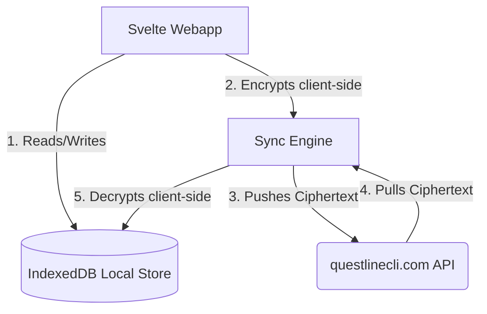

# Implementation Plan: Zero-Knowledge End-to-End Encryption (E2EE) + IndexedDB for Questline Webapp

This document outlines the step-by-step plan to implement **Zero-Knowledge End-to-End Encryption (Option A)** alongside **IndexedDB persistence** in the Svelte web application. 

This approach ensures user data (tasks, notes, journals, etc.) is fully encrypted client-side before being pushed to `questlinecli.com`, while enabling instant page loads by storing the decrypted state in the browser's local database.

---

## Architecture Overview

---

## Step 1: Client-Side Cryptography (WebCrypto API)
We will utilize the browser's native `window.crypto.subtle` API for high-performance encryption and decryption.

1. **Key Derivation**:
   - Derive a symmetric encryption key (AES-GCM 256-bit) from the user's password using PBKDF2 (similar to how the secret key is currently decrypted in `crypto.js`).
   - Store this Derived Symmetric Key only in-memory (volatile state) during the active session.

2. **Encryption / Decryption Helpers** (`webapp/src/lib/crypto.js`):
   - `encryptPayload(payloadJson, derivedKey)`: Encrypts plain-text JSON into ciphertext (AES-GCM) and returns a Base64-encoded string containing the Initialization Vector (IV) and the encrypted bytes.
   - `decryptPayload(ciphertextBase64, derivedKey)`: Decrypts the ciphertext back into plain-text JSON.

---

## Step 2: Browser Storage Setup (IndexedDB)
To prevent the webapp from having to pull and decrypt thousands of sync events on every page refresh, we will cache the decrypted state locally.

1. **IndexedDB Setup** (`webapp/src/lib/db.js`):
   - Initialize a local database named `questline_local_v1`.
   - Create Object Stores mirroring Svelte stores: `projects`, `tasks`, `notes`, `journal_entries`, `milestones`, `focus_sessions`, `achievements`, and `user_stats`.

2. **Database Wrapper Methods**:
   - `saveEntity(storeName, entity)`: Inserts/Updates a decrypted entity.
   - `deleteEntity(storeName, id)`: Deletes an entity.
   - `loadAllEntities(storeName)`: Retrieves all entities to pre-populate Svelte stores on startup.
   - `clearLocalDatabase()`: Clears all stores upon sign-out.

---

## Step 3: Integrating Sync with Encryption & Cache
We will modify the sync engine (`webapp/src/lib/sync.js`) to bridge the API, Cryptography, and IndexedDB.

1. **App Startup / Boot Flow**:
   - Read all records from the local **IndexedDB** stores.
   - Pre-populate the in-memory Svelte stores (`projects`, `tasks`, etc.) with these decrypted records immediately. This guarantees **instant render** on startup.
   - Read the local `questline_sync_seq` cursor.

2. **Incremental Pull Sync (`pullSync`)**:
   - Request events from `/api/sync/pull` since the saved sequence cursor.
   - For each event received:
     - **Decrypt** the `payload` using the derived key.
     - **Save** the decrypted record to **IndexedDB**.
     - **Update** the in-memory Svelte store (triggering UI updates).
   - Save the latest sequence cursor.

3. **Incremental Push Sync (`pushEvent`)**:
   - Save the plain-text entity to local **IndexedDB** and Svelte stores immediately (optimistic UI).
   - **Encrypt** the entity payload using the derived key.
   - Upload the encrypted payload event to `/api/sync/push`.

---

## Step 4: UI Updates
1. **Boot Screen Progress Indicator**:
   - Update the initial spinner to show `Reading local records...` followed by `Syncing with the Realm...`.
2. **Onboarding / Import CLI Progress**:
   - Add a restore portal in the webapp settings.
   - Allow uploading/importing the CLI database backup, decrypting it using the user's keys, inserting all parsed records into IndexedDB, and pushing the initial encrypted state.

---

## Benefits & Goals Achieved
- **Zero-Knowledge Security**: `questlinecli.com` never sees plain-text task titles, scroll contents, or daily reflections.
- **Direct Local Speeds**: Page reloads and routing are instant because data is loaded directly from browser IndexedDB.
- **Fully Bidirectional**: Changes sync transparently back to the CLI app.
